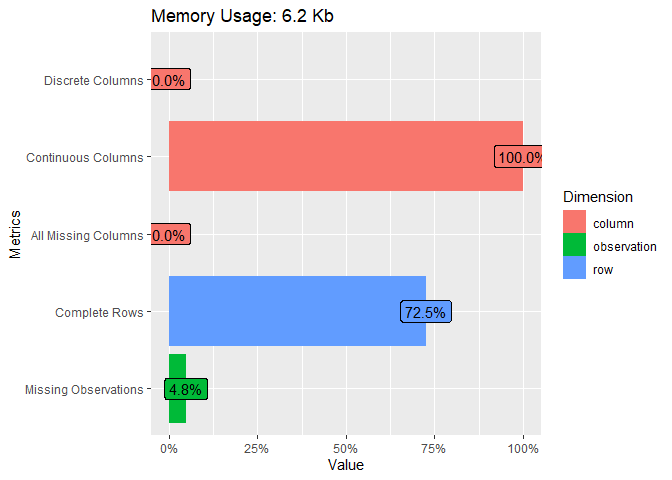

STAT600 - Automated EDA in R
================

## Introduction

After acquiring some new data, doing a proper exploratory data analysis
(EDA) is a very important part. This help to better understand the
structure of our data, potential problems and project the steps needed
to use the particular data set for modeling.

Most of the data analysts would agree that data preparation (cleaning,
putting to the correct format) and exploration of a data set takes a big
chunk of the time devoted to the project.

(Un)Fortunately, people are lazy, thus some started developing some ways
how to speed up the EDA part.

Today I will present three `R` libraries for automatic EDA -
`DataExplorer`, `Hmisc`, `dlookr`.

Notice that there are way more libraries in the field and each is doing
some different. References for more libraries are given in the end.

``` r
library("DataExplorer")
library("Hmisc")
library("dlookr")
```

For presentation of function I used two very popular data sets -
airquality and diamonds.

## DataExplorer

This package is created by Boxuan Cui. Below are presented three
functions from DataExplorer package - `introduce()`, `plot_intro()`, and
`create_report()`.

``` r
DataExplorer::introduce(airquality)
```

    ##   rows columns discrete_columns continuous_columns all_missing_columns
    ## 1  153       6                0                  6                   0
    ##   total_missing_values complete_rows total_observations memory_usage
    ## 1                   44           111                918         6376

``` r
DataExplorer::plot_intro(airquality)
```

<!-- -->

``` r
DataExplorer::create_report(diamonds, y="price", output_file="DataExplorer_diamonds_report.html")
```

Notice, that `create_report()` generates the separate file
`DataExplorer_diamonds_report.html`.

## Hmisc

This package is created by Frank E Harrell Jr, with contributions from
others. Below is showed one function from `Hmisc` package -
`describe()`.

``` r
Hmisc::describe(airquality)
```

    ## airquality 
    ## 
    ##  6  Variables      153  Observations
    ## --------------------------------------------------------------------------------
    ## Ozone 
    ##        n  missing distinct     Info     Mean      Gmd      .05      .10 
    ##      116       37       67    0.999    42.13    35.28     7.75    11.00 
    ##      .25      .50      .75      .90      .95 
    ##    18.00    31.50    63.25    87.00   108.50 
    ## 
    ## lowest :   1   4   6   7   8, highest: 115 118 122 135 168
    ## --------------------------------------------------------------------------------
    ## Solar.R 
    ##        n  missing distinct     Info     Mean      Gmd      .05      .10 
    ##      146        7      117        1    185.9    102.7    24.25    47.50 
    ##      .25      .50      .75      .90      .95 
    ##   115.75   205.00   258.75   288.50   311.50 
    ## 
    ## lowest :   7   8  13  14  19, highest: 320 322 323 332 334
    ## --------------------------------------------------------------------------------
    ## Wind 
    ##        n  missing distinct     Info     Mean      Gmd      .05      .10 
    ##      153        0       31    0.997    9.958    3.964     4.60     5.82 
    ##      .25      .50      .75      .90      .95 
    ##     7.40     9.70    11.50    14.90    15.50 
    ## 
    ## lowest :  1.7  2.3  2.8  3.4  4.0, highest: 16.1 16.6 18.4 20.1 20.7
    ## --------------------------------------------------------------------------------
    ## Temp 
    ##        n  missing distinct     Info     Mean      Gmd      .05      .10 
    ##      153        0       40    0.999    77.88    10.74     60.2     64.2 
    ##      .25      .50      .75      .90      .95 
    ##     72.0     79.0     85.0     90.0     92.0 
    ## 
    ## lowest : 56 57 58 59 61, highest: 92 93 94 96 97
    ## --------------------------------------------------------------------------------
    ## Month 
    ##        n  missing distinct     Info     Mean      Gmd 
    ##      153        0        5     0.96    6.993    1.608 
    ## 
    ## lowest : 5 6 7 8 9, highest: 5 6 7 8 9
    ##                                         
    ## Value          5     6     7     8     9
    ## Frequency     31    30    31    31    30
    ## Proportion 0.203 0.196 0.203 0.203 0.196
    ## --------------------------------------------------------------------------------
    ## Day 
    ##        n  missing distinct     Info     Mean      Gmd      .05      .10 
    ##      153        0       31    0.999     15.8    10.26      2.0      4.0 
    ##      .25      .50      .75      .90      .95 
    ##      8.0     16.0     23.0     28.0     29.4 
    ## 
    ## lowest :  1  2  3  4  5, highest: 27 28 29 30 31
    ## --------------------------------------------------------------------------------

Similar results with some additional information could be presented as
more user-friendly version.

``` r
p <- Hmisc::describe(airquality)
htmltools::save_html(Hmisc::html(p), file="Hmisc_describe_airquality.html")
```

Results are saved into the file `Hmisc_describe_airquality.html`.

## dlookr

This package belongs to the tidyverse universe. Here are presented
function `eda_report()`.

``` r
dlookr::eda_report(diamonds, output_format="html",
                   target="price", 
                   output_file="dlookr_eda_report_diamonds.html",
                   output_dir=getwd())
```

Results are saved into the file `dlookr_eda_report_diamonds.html`.

## Wrap up

If you interested in more packages and their comparison, there are some
references:

  - Overview - The Landscape of R Packages for Automated Exploratory
    Data Analysis by Mateusz Staniak and Przemysław Biecek. M

  - Collection of smart EDA packages:
    <https://github.com/mstaniak/autoEDA-resources>. Feel free checking
    those and finding the one that fits you.
